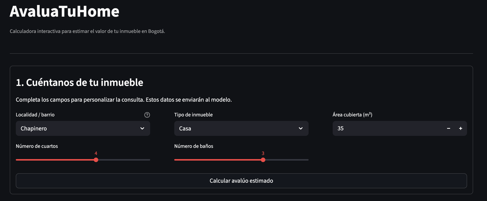
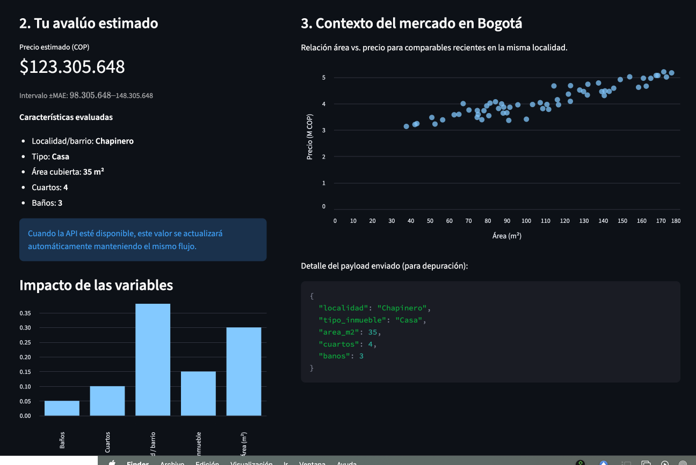

# Entrega 2 – S5 PROJECT E2 (Semana 5)

**Proyecto:** Valoración de inmuebles en Bogotá

## Integrantes del equipo

- Diego Alejandro Lemus Guzman
- Valeria Iglesias Miranda
- Sergio Andres Perdomo Murcia
- Danilo Suarez Vargas

## 1. Problema y contexto (Bogotá)
La estimación del valor comercial de vivienda en **Bogotá** suele apoyarse en comparaciones manuales y criterios subjetivos. Esto introduce variabilidad y tiempos de respuesta elevados para compradores, vendedores y entidades financieras. Con el crecimiento de fuentes abiertas confiables a nivel **ciudad**, es factible construir una **solución analítica** que estandarice y acelere la valoración, con métricas de precisión trazables. La propuesta integra un modelo supervisado con un tablero web para que actores no técnicos consulten avalúos consistentes en segundos.

Esta situación reduce la transparencia y la comparabilidad de los avalúos e impacta la toma de decisiones de hogares, inmobiliarias, aseguradoras y banca hipotecaria. Con este proyecto buscamos disminuir tiempos y sesgos, entregando estimaciones consistentes y explicables para inmuebles en Bogotá, soportadas en datos abiertos verificables y una interfaz que expone la estimación con su intervalo de error e insights de las variables más influyentes.

## 2. Pregunta de negocio y alcance
**Pregunta de negocio.** ¿Cómo desarrollar e implementar un **modelo de predicción** (aprendizaje supervisado) que estime con precisión y rapidez el **valor** de un inmueble en **Bogotá** usando variables físicas, de localización y socioeconómicas, y cómo disponibilizarlo a través de un tablero que encapsule las predicciones, su banda de error y la explicación del modelo?

**Alcance (MVP de esta entrega).**
- Entradas: *área cubierta*, *número de cuartos*, *tipo de inmueble*, *localidad/barrio*, y otras disponibles en el dataset.
- Salida: *precio estimado* y bandas de error (±MAE).
- Métricas objetivo: **RMSE** y **MAE** en validación; reporte de **R²**.
- **Supuestos de la entrega:** enfoque en vivienda residencial; valores en COP; uso de datos abiertos consolidados para Bogotá.
- Fuera de alcance: Integración con APIs externas, actualización en tiempo real y despliegue productivo.

### Cambios respecto a la Entrega 1
- **Ámbito geográfico:** de *Colombia* → **Bogotá**, por disponibilidad y confiabilidad de datasets abiertos a nivel ciudad.
- **Datos:** se sustituyen fuentes generales por un corte consolidado exclusivo de Bogotá; se priorizan variables robustas y disponibles (precio, área, habitaciones, baños, tipo, barrio/UPZ).
- **Alcance del MVP:** se mantiene el prototipo con predicción y métricas (RMSE/MAE), sin APIs públicas ni actualización en tiempo real; se incorporan experimentos trazables en MLflow en EC2.

## 3. Conjuntos de datos a emplear (Bogotá)
**Archivo base:** `inmuebles_bogota.csv` (9,520 registros, 8 columnas).  
**Breve descripción:** datos de anuncios de inmuebles en Bogotá consolidados desde fuentes abiertas; variables principales: `valor` (precio), `área`, `habitaciones`, `baños`, `tipo`, `barrio` y `upz`.  
**Exploración breve (EDA mínima):** a continuación se incluye un resumen con hallazgos rápidos relevantes para el modelado.

### 3.1 Exploración breve (EDA mínima)

- **Tamaño:** 9,520 registros / 8 columnas.

- **Variables clave:** valor (precio), área, habitaciones, baños, tipo, barrio y UPZ.

- **Hallazgos rápidos:** predominan apartamentos sobre casas; la oferta se concentra en zonas del norte; se recomienda tratar atípicos en área/precio antes del entrenamiento.

<table style="width:100%; table-layout:fixed;">
  <tr>
    <td style="vertical-align:top; width:50%; padding-right:12px;">
      <strong>Top barrios por número de registros</strong>
      <table>
        <thead>
          <tr><th></th><th style="text-align:right;">registros</th></tr>
        </thead>
        <tbody>
          <tr><td>Usaquén</td><td style="text-align:right;">1105</td></tr>
          <tr><td>Zona Noroccidental</td><td style="text-align:right;">877</td></tr>
          <tr><td>Bosa</td><td style="text-align:right;">589</td></tr>
          <tr><td>Kennedy</td><td style="text-align:right;">589</td></tr>
          <tr><td>Cedritos</td><td style="text-align:right;">554</td></tr>
          <tr><td>Barrios Unidos</td><td style="text-align:right;">473</td></tr>
          <tr><td>Engativa</td><td style="text-align:right;">462</td></tr>
          <tr><td>Suba</td><td style="text-align:right;">443</td></tr>
          <tr><td>Santa Barbara</td><td style="text-align:right;">438</td></tr>
          <tr><td>Chapinero</td><td style="text-align:right;">332</td></tr>
          <tr><td>Fontibón</td><td style="text-align:right;">270</td></tr>
          <tr><td>Chico Reservado</td><td style="text-align:right;">225</td></tr>
          <tr><td>Teusaquillo</td><td style="text-align:right;">180</td></tr>
          <tr><td>El Batán</td><td style="text-align:right;">133</td></tr>
          <tr><td>Puente Aranda</td><td style="text-align:right;">116</td></tr>
        </tbody>
      </table>
    </td>
    <td style="vertical-align:top; width:50%; padding-left:12px;">
      <strong>Distribución por tipo de inmueble</strong>
      <table>
        <thead>
          <tr><th></th><th style="text-align:right;">registros</th></tr>
        </thead>
        <tbody>
          <tr><td>Apartamento</td><td style="text-align:right;">7327</td></tr>
          <tr><td>Casa</td><td style="text-align:right;">2043</td></tr>
          <tr><td>Oficina/Consultorio</td><td style="text-align:right;">60</td></tr>
          <tr><td>Local</td><td style="text-align:right;">38</td></tr>
          <tr><td>Edificio</td><td style="text-align:right;">22</td></tr>
          <tr><td>Bodega</td><td style="text-align:right;">13</td></tr>
          <tr><td>Finca</td><td style="text-align:right;">11</td></tr>
          <tr><td>Lote</td><td style="text-align:right;">6</td></tr>
        </tbody>
      </table>
    </td>
  </tr>
</table>

## 5. Modelos desarrollados y evaluación
- **Fuente y preparación:** el script `models/models-mlflow.py` y el notebook `03_PRUEBA_MODELOS_BOGOTA.ipynb` consumen `inmuebles_bogota 2.csv` (9.5k registros). Se limpian los campos `Valor` y `Área`, se crean `log_valorventa` y `log_marea` para estabilizar la varianza y se codifican `Tipo` y `Barrio` con `pd.get_dummies`.
- **Conjunto de entrenamiento:** `X = [Tipo, Habitaciones, Baños, log_marea, Barrio]`, `y = log_valorventa`, con partición 80/20 y semilla 42.
- **Experimentación:** cada modelo registra parámetros, métricas y artefactos en el experimento MLflow `modelos_inmuebles_bogota`, lo que asegura trazabilidad y reproducibilidad.
- **Resultados:** los ensambles superan a los baselines lineales. Las métricas se reportan en la escala log10 del target, acompañadas del MAPE para facilitar su interpretación.

| Modelo | Configuración | RMSE (log10) | MAE (log10) | R² | MAPE |
|---|---|---:|---:|---:|---:|
| SGD Regressor (baseline) | `log_marea` como única feature, `max_iter=1000` | — | — | — | 1.69 % |
| Ridge | `alpha=1.0` | 0.1339 | 0.0966 | 0.841 | 1.20 % |
| LightGBM | `num_leaves=31`, `learning_rate=0.01`, `n_estimators=1000` (early stopping) | 0.1092 | 0.0780 | 0.894 | 0.89 % |
| Random Forest | `n_estimators=300`, `max_depth=12`, `n_jobs=-1` | **0.1072** | **0.0755** | **0.898** | **0.87 %** |

> Random Forest se posiciona como modelo “champion” al entregar el mejor balance entre MAE/RMSE, MAPE bajo y R² alto. Sus métricas alimentan las bandas ±MAE y el mensaje de precisión que se muestran en el tablero.

## 6. Experimentos (MLflow en EC2)
- Registrar parámetros, métricas y artefactos (firma del modelo).
- Incluir en `docs/evidencias_mlflow/` pantallazos con **IP pública de la EC2** y **usuario** visibles.
- Conclusiones: hiperparámetros con mayor impacto y run “champion” seleccionado.

## 7. Prototipo / Tablero
- **Objetivo:** operacionalizar la respuesta a la pregunta de negocio permitiendo que usuarios no técnicos ingresen los datos del inmueble y reciban un avalúo consistente con contexto de mercado.
- **Entradas:** localidad/barrio (selector alineado con UPZ), tipo de inmueble, área cubierta (m²), número de cuartos y número de baños. Cada campo incluye ayudas visuales para asegurar calidad en la captura.
- **Salidas:** valor estimado en COP, intervalo ±MAE mostrado como píldora destacada, resumen de características evaluadas, visualización de relación área vs. precio en Bogotá y módulo “Factores que más impactan tu avalúo” (espacio reservado para SHAP/feature importance).
- **Implementación:** además del mockup HTML (`dashboard/mockup/mockup.html`), se construyó una app en Streamlit (`dashboard/app.py`). Esta versión ejecutable replica el diseño final, captura los inputs y, mientras se conecta la API, genera respuestas mock que permiten demostrar el flujo completo. Se ejecuta con `cd dashboard && streamlit run app.py`.
- **Integración prevista:** el formulario consumirá `POST /api/v1/avaluo`. La app ya incluye un helper (`MODEL_ENDPOINT`) para redirigir la llamada a la API real tan pronto se despliegue.

*Figura 1. Formulario del tablero con ayudas contextuales y CTA principal.*

*Figura 2. Panel de resultados con valor estimado, intervalo ±MAE y visualización de comparables.*

## 8. Reporte de trabajo en equipo (resumen)
> **Integrantes:** Diego Alejandro Lemus Guzman; Valeria Iglesias Miranda; Sergio Andres Perdomo Murcia; Danilo Suarez Vargas.

- **Datos/EDA:** preparación de cortes Bogotá, diccionario, limpieza básica.
- **Modelado (Valeria Iglesias):** experimentos en MLflow, comparación de modelos y selección (en progreso).
- **Tablero (Danilo Suarez):** diseño de la experiencia, construcción del mockup y definición de la integración con la API.
- **Infra/DevOps:** configuración de entorno (EC2/venv), tracking MLflow.
- **Documentación:** armado de este reporte y evidencias.

## 9. Observaciones y siguientes pasos
- La ubicación (localidad/barrio) y el tipo de inmueble son determinantes del precio; el área presenta efecto no lineal.
- El tablero y el script de modelado emplean el mismo set de variables, por lo que la integración con la API será directa (solo se requiere aplicar las mismas transformaciones `log10` y `get_dummies` en el backend).
- Se profundizará en el enriquecimiento con variables geoespaciales y en la validación cruzada por localidad para seguir elevando la precisión del modelo y la calidad de los insights que consume el tablero.
