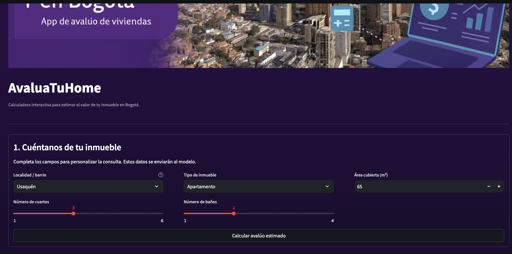
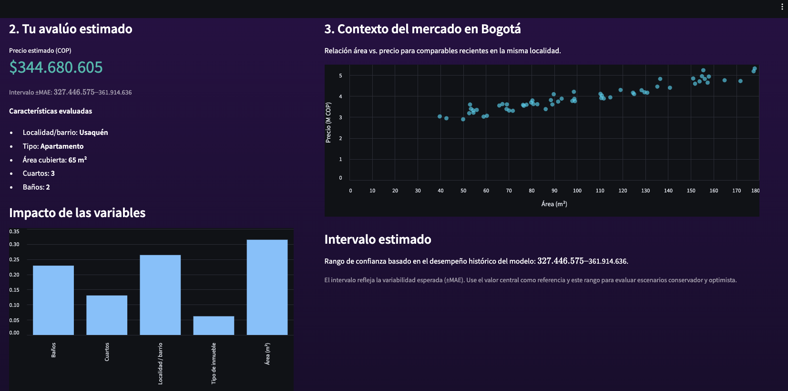
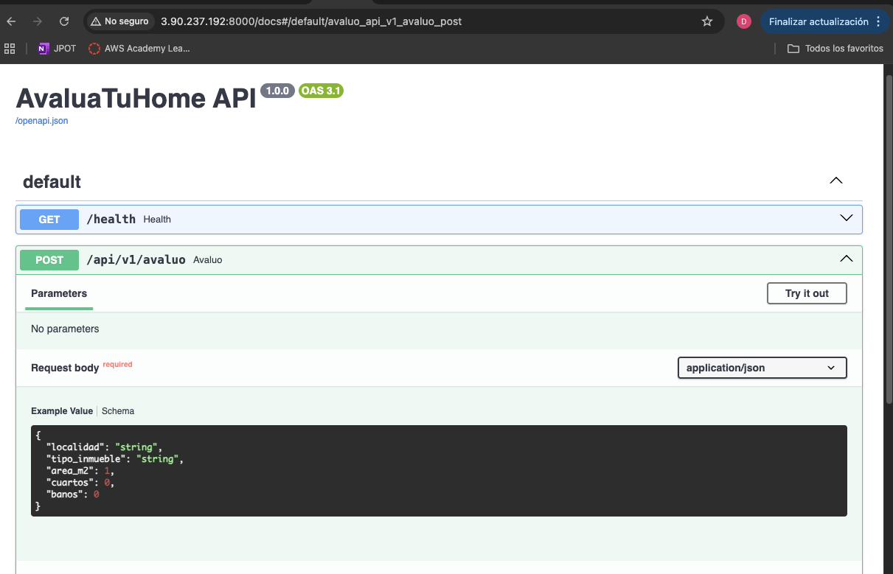
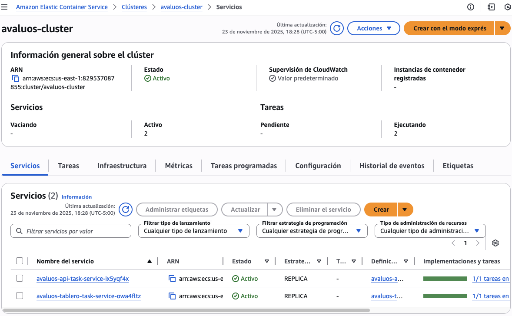
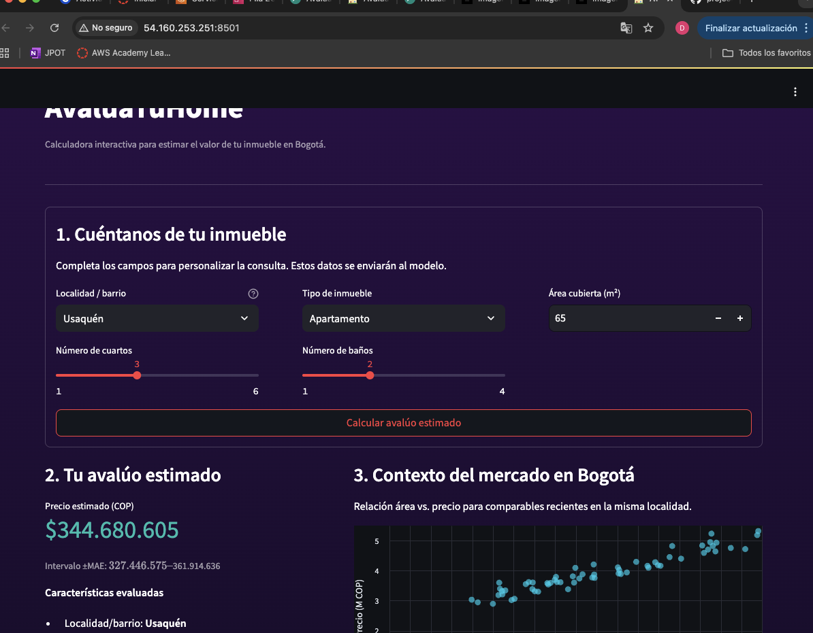

# Entrega final – AvaluaTuHome

**Proyecto:** Valoración de inmuebles en Bogotá (modelo + API + tablero en producción)

## Integrantes del equipo

- Diego Alejandro Lemus Guzman
- Valeria Iglesias Miranda
- Sergio Andres Perdomo Murcia
- Danilo Suarez Vargas

## 1. Problema y contexto (Bogotá)
La estimación del valor comercial de vivienda en **Bogotá** suele apoyarse en comparaciones manuales y criterios subjetivos. Esto introduce variabilidad y tiempos de respuesta elevados para compradores, vendedores y entidades financieras. Con el crecimiento de fuentes abiertas confiables a nivel **ciudad**, es factible construir una **solución analítica** que estandarice y acelere la valoración, con métricas de precisión trazables. La propuesta integra un modelo supervisado con un tablero web para que actores no técnicos consulten avalúos consistentes en segundos.

Esta situación reduce la transparencia y la comparabilidad de los avalúos e impacta la toma de decisiones de hogares, inmobiliarias, aseguradoras y banca hipotecaria. Con este proyecto buscamos disminuir tiempos y sesgos, entregando estimaciones consistentes y explicables para inmuebles en Bogotá, soportadas en datos abiertos verificables y una interfaz que expone la estimación con su intervalo de error e insights de las variables más influyentes.

## 2. Pregunta de negocio y alcance
**Pregunta de negocio.** ¿Cómo desarrollar e implementar un **modelo de predicción** (aprendizaje supervisado) que estime con precisión y rapidez el **valor** de un inmueble en **Bogotá** usando variables físicas, de localización y socioeconómicas, y cómo disponibilizarlo a través de un tablero que encapsule las predicciones, su banda de error y la explicación del modelo?

**Alcance (entrega final).**
- Entradas: *área cubierta*, *número de cuartos*, *tipo de inmueble*, *localidad/barrio*, y otras disponibles en el dataset.
- Salida: *precio estimado* y bandas de error (±MAE).
- Métricas objetivo: **RMSE** y **MAE** en validación; reporte de **R²**.
- **Supuestos de la entrega:** enfoque en vivienda residencial; valores en COP; uso de datos abiertos consolidados para Bogotá.
- Fuera de alcance: Integración con APIs externas adicionales, actualización en tiempo real y dominios propios/HTTPS.

### Cambios respecto a entregas anteriores (2/3)
- **Ámbito y datos:** consolidación exclusiva de Bogotá con variables clave (precio, área, cuartos, baños, tipo, barrio/UPZ) y limpieza/log-transform para estabilizar varianza.
- **Modelos:** experimentación completa en MLflow (Ridge, Random Forest, LightGBM); se selecciona Random Forest (500 árboles) como modelo campeón.
- **API y empaquetado:** se construye la API de inferencia (FastAPI) y se empaquetan API/tablero en Docker; imágenes publicadas en ECR.
- **Despliegue:** API y tablero desplegados en ECS Fargate con endpoints públicos; manuales de instalación y usuario actualizados.

## 3. Conjuntos de datos a emplear (Bogotá)
**Archivo base:** `inmuebles_bogota.csv` (9,520 registros, 8 columnas).  
**Breve descripción:** datos de anuncios de inmuebles en Bogotá consolidados desde fuentes abiertas; variables principales: `valor` (precio), `área`, `habitaciones`, `baños`, `tipo`, `barrio` y `upz`.  
**Exploración breve (EDA mínima):** a continuación se incluye un resumen con hallazgos rápidos relevantes para el modelado.

### 3.1 Exploración breve (EDA mínima)

- **Tamaño:** 9,520 registros / 8 columnas.

- **Variables clave:** valor (precio), área, habitaciones, baños, tipo, barrio y UPZ.

- **Hallazgos rápidos:** predominan apartamentos sobre casas; la oferta se concentra en zonas del norte; se recomienda tratar atípicos en área/precio antes del entrenamiento.

### 3.2 Distribución de registros

<table style="width:100%; table-layout:fixed;">
  <tr>
    <td style="vertical-align:top; width:50%; padding-right:12px;">
      <strong>Top barrios por número de registros</strong>
      <table>
        <thead>
          <tr><th></th><th style="text-align:right;">registros</th></tr>
        </thead>
        <tbody>
          <tr><td>Usaquén</td><td style="text-align:right;">1105</td></tr>
          <tr><td>Zona Noroccidental</td><td style="text-align:right;">877</td></tr>
          <tr><td>Bosa</td><td style="text-align:right;">589</td></tr>
          <tr><td>Kennedy</td><td style="text-align:right;">589</td></tr>
          <tr><td>Cedritos</td><td style="text-align:right;">554</td></tr>
          <tr><td>Barrios Unidos</td><td style="text-align:right;">473</td></tr>
          <tr><td>Engativa</td><td style="text-align:right;">462</td></tr>
          <tr><td>Suba</td><td style="text-align:right;">443</td></tr>
          <tr><td>Santa Barbara</td><td style="text-align:right;">438</td></tr>
          <tr><td>Chapinero</td><td style="text-align:right;">332</td></tr>
          <tr><td>Fontibón</td><td style="text-align:right;">270</td></tr>
          <tr><td>Chico Reservado</td><td style="text-align:right;">225</td></tr>
          <tr><td>Teusaquillo</td><td style="text-align:right;">180</td></tr>
          <tr><td>El Batán</td><td style="text-align:right;">133</td></tr>
          <tr><td>Puente Aranda</td><td style="text-align:right;">116</td></tr>
        </tbody>
      </table>
    </td>
    <td style="vertical-align:top; width:50%; padding-left:12px;">
      <strong>Distribución por tipo de inmueble</strong>
      <table>
        <thead>
          <tr><th></th><th style="text-align:right;">registros</th></tr>
        </thead>
        <tbody>
          <tr><td>Apartamento</td><td style="text-align:right;">7327</td></tr>
          <tr><td>Casa</td><td style="text-align:right;">2043</td></tr>
          <tr><td>Oficina/Consultorio</td><td style="text-align:right;">60</td></tr>
          <tr><td>Local</td><td style="text-align:right;">38</td></tr>
          <tr><td>Edificio</td><td style="text-align:right;">22</td></tr>
          <tr><td>Bodega</td><td style="text-align:right;">13</td></tr>
          <tr><td>Finca</td><td style="text-align:right;">11</td></tr>
          <tr><td>Lote</td><td style="text-align:right;">6</td></tr>
        </tbody>
      </table>
    </td>
  </tr>
</table>

## 4. Modelos desarrollados y evaluación

- **Fuente y preparación:** el script `models/models-mlflow.py` y el notebook `03_PRUEBA_MODELOS_BOGOTA.ipynb` consumen `inmuebles_bogota 2.csv` (9.5k registros). Se limpian los campos `Valor` y `Área`, se crean `log_valorventa` y `log_marea` para estabilizar la varianza y se codifican `Tipo` y `Barrio` con `pd.get_dummies`.
- **Conjunto de entrenamiento:** `X = [Tipo, Habitaciones, Baños, log_marea, Barrio]`, `y = log_valorventa`, con partición 80/20 y semilla 42.
- **Experimentación:** cada modelo registra parámetros, métricas y artefactos en el experimento MLflow `modelos_inmuebles_bogota`, lo que asegura trazabilidad y reproducibilidad.
- **Resultados:** los ensambles superan a los baselines lineales. Las métricas se reportan en la escala log10 del target, acompañadas del MAPE para facilitar su interpretación.

Se consideran 4 modelos diferentes, cambiando sus hiperparámetros para observar el comportamiento de las métricas de evaluación. Y se obtuvieron las siguientes mejores métricas para cada modelo:

| Modelo | Features | Hiperparámetros | MSE | MAE | R² |
|---|---|---|---:|---:|---:|
| Regresión lineal | [área, cuartos, tipo, localidad/barrio] | log(target)=SÍ | 0.018 | 0.096 | 0.841 |
| Ridge | idem | α=0.01 | 0.018 | 0.096 | 0.841 |
| Random Forest | idem + interacciones simples | n_estimators=500, max_depth=None, max_features=8 | 0.011 | 0.063 | 0.905 |
| LGBM | idem | learning_rate=0.01, n_estimators=500, num_leaves=15 | 0.014 | 0.086 | 0.872 |

### 4.1 Modelo de Regresión Lineal

Primero se entrenó un modelo de regresión lineal como base, debido a su simplicidad, rapidez de entrenamiento e interpretabilidad, lo que nos permitió tener un punto de partida para comparar los modelos. Se utilizó un modelo LinearRegression, considerando las variables log(Área), Baños, Habitaciones, Tipo y Barrio, y se aplicó la transformación logarítmica a la variable predictora Valor para estabilizar la varianza y reducir el sesgo.

A continuación, se muestra un gráfico de predicciones vs valores reales en escala logarítmica. Cada punto representa la predicción de un inmueble en el conjunto de prueba, y la línea roja  indica la predicción. Cuanto más cerca estén los puntos de esta línea, mejor se ajusta el modelo a los datos:

El MAE del modelo fue de 0.096 en la base logaritmica, lo que indica que, en promedio la predicción del precio difiere de su valor real en aproximadamente 9.6% en escala logarítmica. Esto muestra que los errores absolutos son moderados y relativamente consistentes entre los diferentes registros. El MSE fue de 0.018, lo que muestra que los errores más grandes tienen un impacto moderado en la evaluación global del modelo. Un valor bajo de MSE nos dice que no existen muchas predicciones extremadamente desviadas respecto al valor real. El R² alcanzó un valor de 0.841, lo que indica que el 84.1% de la variabilidad de los precios de los inmuebles se explica por las variables seleccionadas. Esto confirma que el modelo lineal logra capturar la mayoría de la información presente en los datos.

En conclusión, las métricas muestran que el modelo de regresión lineal ofrece un buen punto de partida. Siendo así un modelo interpretable y que explica un gran parte de la variabilidad de los datos. Sin embargo, se probaron otros modelos más complejos para poder capturar relaciones no lineales entre las variables.

### 4.2 Modelo de Ridge

En un segundo momento, se entrenó el modelo de Ridge Regression, el cual es una modificación del modelo de regresión lineal que incorpora regularización L2 para reducir el sobreajuste y manejar la multicolinealidad entre variables. Se consideraron las mismas variables y solo se consideró el hiperparámetro alpha, que controla la fuerza de regularización L2.

Se corrió el modelo con α = 50, 0.01, 1.0, 10.0 y 4.0. El modelo que obtuvo mejores métricas fue el que usó α = 4.0, logrando un  MAE de 0.096, indicando un error absoluto promedio del 9.7% en la escala logarítmica. El MSE fue de 0.018, mostrando que los errores más grandes tienen un impacto moderado. Y un R² de 0.841, lo que significa que el modelo explica aproximadamente el 83.9% de la variabilidad del precio de los inmuebles.

Sin embargo, estas métricas no mostraron una mejora respecto al modelo de regresión lineal, lo que indica que, la regularización L2 no aportó un beneficio sobre la regresión lineal simple.

### 4.3 Random Forest

Posteriormente, entrenamos un modelo de Random Forest Regressor, un modelo de ensamble basado en árboles de decisión que permite capturar relaciones no lineales y manejar interacciones más complejas entre variables. Este modelo es menos interpretable, pero puede mejorar el desempeño al reducir el sesgo del modelo lineal y manejar la varianza a través del promedio de múltiples árboles.

Se evaluaron diferentes configuraciones de los hiperparámetros n_estimators, max_features y max_depth para seleccionar la combinación más optima. Entre las combinaciones que probamos, el modelo con n_estimators = 500, max_features = 8 y max_depth = None obtuvo las mejores métricas, un MAE de 0.063, un MSE de 0.011 y un R² de 0.905.

Estas métricas muestran una mejora signitificativa respecto a los dos modelos anteriores, lo cual indica que Random Forest logra capturar esas relaciones no lineales entre las variables y logra reducir los errores de predicción. Un MAE menor indica que las predcciones son más cercanas a las reales, un MSE menor indica menor impacto en los valores grandes  y un R² un poco mayor, de un 90%, confirma que el modelo logra explicar casi toda la variabilidad de los datos.

### 4.4 LightGBM

Para entrenar el modelo LightGBM, se utilizaron las mismas características que en los modelos anteriores, log(Área), Baños, Habitaciones, Tipo y Barrio. Esta selección se realizó porque estas variables son las que impactan directamente en el valor de los inmuebles:

- Área: tamaño de la propiedad, un factor determinante del precio.
- Baños y Habitaciones: reflejan el interior del inmueble.
- Tipo: permite diferenciar entre apartamentos, casas y otros tipos de inmuebles.
- Barrio: captura la influencia de la ubicación geográfica sobre el precio.

LightGBM es un modelo de gradiente boosting basado en árboles que permite capturar relaciones no lineales entre las variables. Se experimentó con los siguiente hiperparámetros:

- n_estimators: 100, 200, 300, 500. Esta métrica define cuantos arboles se construirán, un valor más alto, como 500, hace que el modelo aprenda patrones más complejos.
- learning_rate : 0.001, 0.005, 0.01. La taza de aprendiza controla que tanto se ajusta cada árbol nuevo a los errores del conjunto anterior. Un valor más bajo hace que el aprendizaje sea más lento, pero tiende a  mejorar la generalización.
- num_leaves : 15, 30, 31, 63. El número de hojas por arbol, determina la complejidad de cada árbol, cuántas particiones se pueden hacer en los datos. Un número alto permite capturar interacciones y relaciones no lineales más complejas.

El modelo que mostró mejores métricas fue n_estimators igual a 300, un learning_rate igual a 0.01 y un num_leaves igual a 30, logrando un MAE de 0.088, indicando un error absoluto promedio del 8.8%. Un MSE de 0.015, indicando que los errores grandes tuvieron un impacto moderado. Y un R² de 0.868, lo que significa que el 86.8% de la variabilidad del precio de los inmuebles se explica por las variables seleccionadas.

### 4.5 Conclusiones generales sobre el comportamiento de los modelos

Al analizar estos 4 modelos, se llegan a las siguientes conclusiones:

- El modelo de regresión lineal y Ridge, mostraron métricas muy similares, lo cual podría indicar que no se presentaba problemas de sobreajuste o colinealidad en los datos.
- El modelo Random Forest mejoró las métricas respecto a los dos modelos anteriores, capturando relaciones no lineales y combinaciones de variables. Logró mejorar el R² hasta el 90% y reducir significativamente el MAE a 0.063. Este modelo es menor interpretable, pero logra mejorar las predicciones cuando existen relaciones no lineales entre las variables.
- Por último, LightGBM mostró métricas similares a Random Forest, es un modelo que se destaca por su velocidad en el entrenamiento y eficiencia en conjuntos de datos grandes, por lo cual sería necesario considerarlo si se llegara a aumentar los datos de entrenamiento.

Para este proyecto, el modelo de Random Forest con n_estimators=500, max_depth=None y max_features=8 se destacó como el mejor en términos de MAE y R², siendo así el modelo escogido para el despliegue y desarrollo de la interefaz.

## 5. Experimentos (MLflow en EC2)

Los modelos se corrieron sobre una máquina virtual Ubuntu, tipo t2.medium, con 20 GB de almacenamiento. La dirección IP es: 34.228.156.128. Se adjunta evidencia de la maquina en ejecución:

Se ejecutaron en total 20 modelos, 5 combinaciones de hiperparámetros para cada modelo. Se adjunta evidencia:

El RUN ID del modelo seleccionado fue 4d891f949d1143a4b290e9bbe630a04a, se descargó de mlflow en formato .pkl. Este archivo contiene el modelo entrenado con sus parámetros optimizados.

## 6. Tablero en producción
- **Objetivo:** permitir a usuarios no técnicos ingresar datos del inmueble y recibir un avalúo con intervalo de confianza y contexto de mercado.
- **Entradas:** localidad/barrio (Bogotá), tipo de inmueble, área cubierta (m²), cuartos y baños.
- **Salidas:** valor estimado en COP, intervalo ±MAE, importancias de variables (feature importance) y gráfico área vs. precio con comparables en Bogotá.
- **URLs productivas:** tablero `http://54.160.253.251:8501/`; API `http://3.90.237.192:8000/api/v1/avaluo` (docs en `/docs`).
- **Implementación:** Streamlit (`dashboard/app.py`) conectado a la API de producción; imagenes Docker publicadas en ECR y desplegadas en ECS Fargate. La versión `app-pkl.py` queda como alternativa offline con el modelo serializado.
- **Capturas:** ver a continuación; Manual de usuario en `Entregas/Entrega_3/Manual_usuario_tablero.md`.

*Panel del tablero donde se ingresan los datos del inmueble (localidad, tipo, área, cuartos y baños).*

*Vista de resultados con avalúo estimado, intervalo ±MAE, impacto de variables y comparables.*

## 7. Despliegue y manuales
- **Arquitectura:** API y tablero contenedorizados y desplegados en AWS ECS Fargate con imágenes en ECR. Security Groups abren puertos 8000 (API) y 8501 (tablero). Endpoints actuales: API `http://3.90.237.192:8000/api/v1/avaluo` (docs en `/docs`) y tablero `http://54.160.253.251:8501/`.
- **Evidencias:** `/docs` de la API accesible, servicios ECS en RUNNING, UI del tablero funcional en la IP pública, runs en MLflow con artefactos (`model.pkl`, `columnas_modelo.pkl`).
- **Manuales:** 
  - Instalación/despliegue: `Entregas/Entrega_3/Manual_instalacion_tablero.md`
  - Usuario final: `Entregas/Entrega_3/Manual_usuario_tablero.md`

*Vista de `/docs` de la API en el endpoint público (`http://3.90.237.192:8000/docs`).*

*Estado del clúster y servicios en AWS ECS (API y tablero desplegados).*

*Tablero operativo en la URL pública (`http://54.160.253.251:8501/`).*

## 8. Resultados y conclusiones
El modelo campeón (Random Forest, 500 árboles) entrega un MAE log10 ≈ 0.0755 (8–9% de error relativo) y R² ≈ 0.898, lo que se traduce en avalúos en COP con intervalos coherentes con el desempeño histórico. Para el usuario final, el tablero ofrece un avalúo en segundos, acompañado de un rango de confianza visible y explicabilidad básica (importancias), facilitando decisiones en contextos inmobiliarios y financieros en Bogotá. La solución está desplegada en ECS con imágenes en ECR y endpoints públicos documentados, respaldada por manuales de instalación y uso; este ensamblaje de datos, versionado de modelos, API y front-end consumible demuestra un flujo de analítica reproducible y listo para iterar (reentrenar, publicar nueva imagen y redeploy) con mínimos cambios operativos.

## 9. Fuentes, código y soportes
- **API:** carpeta `api/` (FastAPI); Dockerfile de la API en la raíz (`Dockerfile.api`).
- **Tablero:** carpeta `dashboard/` (Streamlit); Dockerfile del tablero en la raíz (`Dockerfile.dashboard`).
- **Modelo y artefactos:** carpeta `models/` (`model.pkl`, `columnas_modelo.pkl`, scripts de entrenamiento y `requirements.txt`).
- **Repositorio Git:** `https://github.com/sergioandres0180/project-dsa.git`.
- **Manuales:** `Entregas/Entrega_3/Manual_instalacion_tablero.md` y `Entregas/Entrega_3/Manual_usuario_tablero.md`.
- **Evidencias MLflow:** runs registrados (run ID: 4d891f949d1143a4b290e9bbe630a04a) con capturas en `Entregas/Entrega_final/Imagenes/` (maquina-ubuntu.png, modelos.png).

## 10. Reporte de trabajo en equipo (resumen)
> **Integrantes:** Diego Alejandro Lemus Guzman; Valeria Iglesias Miranda; Sergio Andres Perdomo Murcia; Danilo Suarez Vargas.

- **Datos y EDA (Diego A. Lemus):**
  - Recolección y consolidación de datasets de anuncios de Bogotá.
  - Limpieza de variables numéricas/categóricas; generación de `log_valorventa` y `log_marea`.
  - Elaboración del diccionario de datos y hallazgos de EDA (distribuciones, outliers, variables clave).
  - Aporte al guion del video en la parte de contexto/datos.
- **Modelado y métricas (Valeria Iglesias):**
  - Configuración de experimentos en MLflow (Ridge, Random Forest, LightGBM) con trazabilidad de parámetros y runs.
  - Tuning y selección del modelo campeón (Random Forest 500 árboles); exporte de `model.pkl` y `columnas_modelo.pkl`.
  - Documentación de métricas (MAE/RMSE/R², MAPE) y justificación de la elección del modelo.
- **Tablero e integración (Danilo Suarez):**
  - Diseño UI/UX y desarrollo de `dashboard/app.py` y `app-pkl.py` (inputs, resultados, importancias, gráficos).
  - Integración con la API de producción (MODEL_ENDPOINT) y refinamiento de textos/estilo.
  - Actualización de manuales (usuario/instalación) y README, incorporación de banner e imágenes.
- **Empaquetado y despliegue (Danilo Suarez):**
  - Creación de Dockerfile de API y tablero; build multi-arch y publicación en ECR.
  - Despliegue de API y tablero en ECS Fargate, configuración de SG y validación de endpoints.
- **Infra/DevOps y manuales (Sergio A. Perdomo):**
  - Aprovisionamiento de EC2/MLflow, instalación de dependencias y soporte para uso local del modelo.
  - Validación de servicios desplegados, revisión de endpoints y contribución a manuales (instalación/usuario).
